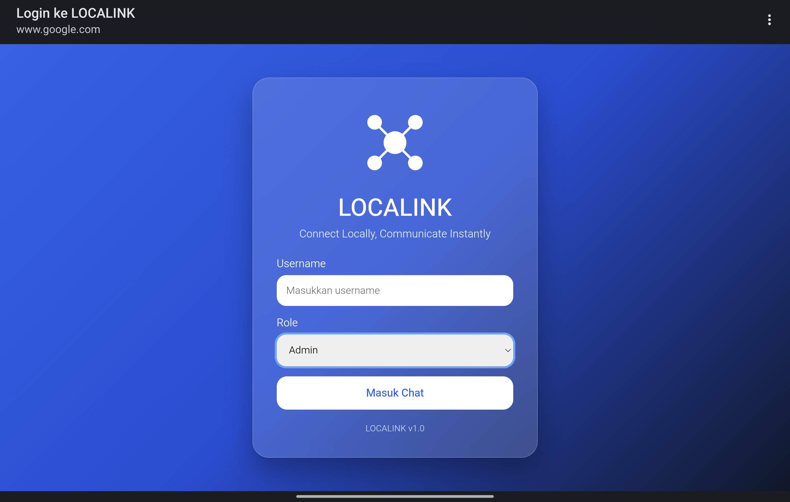
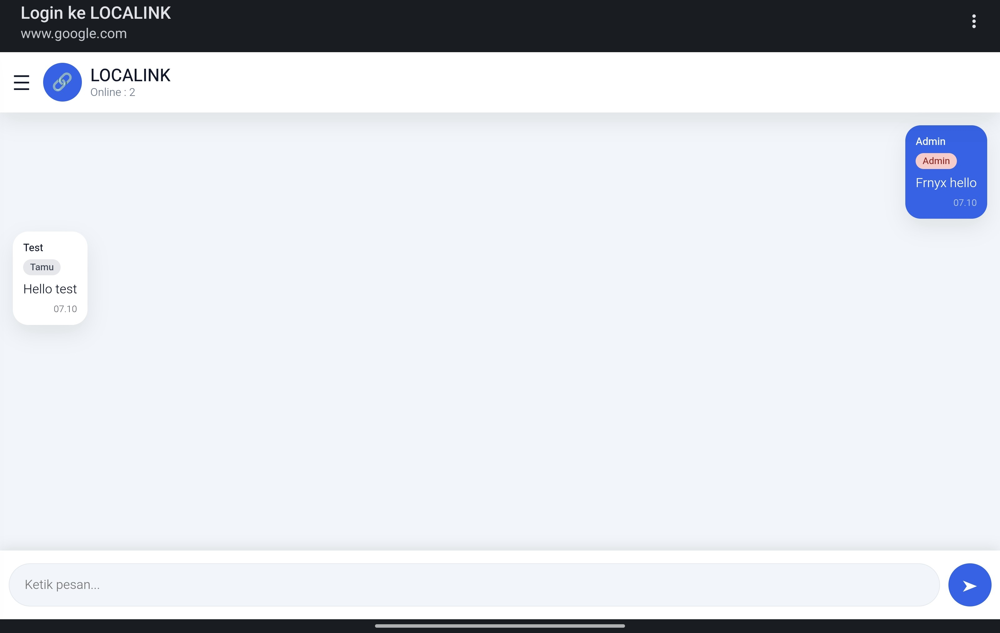
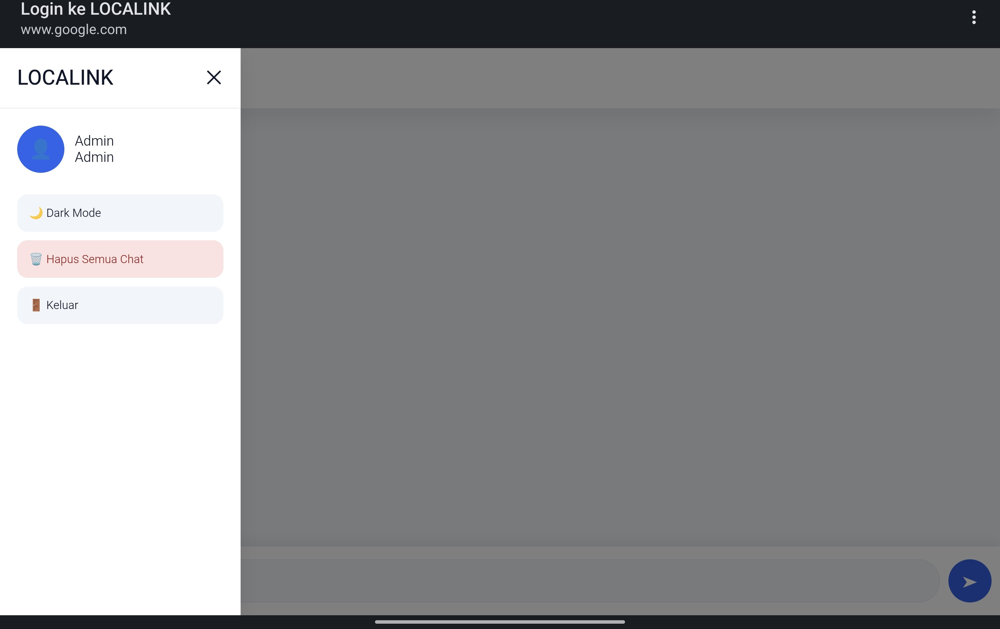

<div align="center">


# 🔗 LOCALINK

### Connect Locally, Communicate Instantly

Offline local network chat powered by **ESP8266**, **WebSocket**, **LittleFS**, and **Captive Portal**.


</div>

---

## 📖 Overview

LOCALINK is a lightweight offline chat platform built on ESP8266 that allows users to communicate in real-time without requiring internet access.

Users simply connect to the LOCALINK WiFi network and instantly gain access to a modern web-based chat room through their browser.

No internet.
No cloud server.
No mobile application.

Just connect and chat.

---

## ✨ Features

### 🌐 Network

- ESP8266 Access Point Mode
- Offline Communication
- No Internet Required
- Captive Portal Support
- Automatic Login Redirection

### 💬 Chat

- Real-Time Messaging
- WebSocket Communication
- Multi User Chat Room
- Instant Message Broadcast
- Online User Counter
- Chat History Support

### 👤 User Management

- Username Login
- Role-Based Access
- Admin
- Operator
- Staff
- Guest

### 🎨 User Interface

- Modern WhatsApp Style Interface
- Responsive Mobile Design
- Desktop Compatible
- Dark Mode
- Sidebar Navigation
- Toast Notifications

### 💾 Storage

- LittleFS Storage
- Persistent Message History
- Automatic Chat Recovery

---

## 🏗 Architecture

```text
            ┌─────────────────┐
            │    ESP8266 AP   │
            │    LOCALINK     │
            └────────┬────────┘
                     │
         ┌───────────┼───────────┐
         │           │           │
         ▼           ▼           ▼

      User A      User B      User C

         │           │           │
         └────── WebSocket ──────┘

                 ▼

          LOCALINK CHAT
```

## 📸 Screenshots

### Login Page



### Chat Room



### Admin Sidebar



---

## ⚙ Hardware Requirements

| Component | Description |
|------------|------------|
| ESP8266 NodeMCU V3 | Main Controller |
| USB Cable | Programming |
| Smartphone / Laptop | Client Device |

---

## 📦 Software Requirements

### Arduino IDE

Recommended:

- Arduino IDE 2.x

### Required Libraries

- ESP8266WiFi
- ESPAsyncTCP
- ESPAsyncWebServer
- LittleFS
- DNSServer

---

## 📂 Project Structure

```text
LOCALINK/
│
├── Localink.ino
│
├── data/
│   ├── index.html
│   ├── chat.html
│   ├── style.css
│   ├── app.js
│   ├── logo.svg
│   ├── manifest.json
│   └── messages.json
│
├── screenshots/
│   ├── login.jpg
│   ├── chat-room.jpg
│   └── sidebaradmin.jpg
│
├── README.md
├── LICENSE
└── .gitignore
```

---

## 🚀 Installation

### Clone Repository

```bash
git clone https://github.com/farhanadeata/LOCALINK.git
```

### Open Arduino IDE

Load:

```text
Localink.ino
```

### Install Required Libraries

Install all required libraries listed above.

### Upload Firmware

Board:

```text
NodeMCU 1.0 (ESP-12E Module)
```

Upload sketch to ESP8266.

### Upload LittleFS Files

Upload all files inside:

```text
data/
```

using LittleFS Data Upload Tool.

### Connect To LOCALINK

```text
SSID     : LOCALINK
Password : Frnyx2708
```

Open:

```text
http://192.168.4.1
```

or allow Captive Portal to redirect automatically.

---

## 🎯 Use Cases

- School Communication
- Local Events
- Emergency Communication
- Community Networks
- Rural Areas Without Internet
- Temporary Communication Systems
- Correctional Facility Communication Experiments
- Offline IoT Demonstrations

---

## 🛣 Roadmap

### Version 1.0

- [x] Offline Chat
- [x] WebSocket Realtime
- [x] LittleFS Storage
- [x] Captive Portal
- [x] Responsive UI
- [x] Dark Mode

### Future Versions

- [ ] Private Messaging
- [ ] Emoji Support
- [ ] User Presence Status
- [ ] Multi Room Chat
- [ ] ESP32 Version
- [ ] File Sharing
- [ ] Voice Notes
- [ ] Mesh Networking

---

## 🤝 Contributing

Contributions, feature requests, bug reports, and pull requests are welcome.

Feel free to fork this repository and improve LOCALINK.

---

## 📄 License

This project is released under the MIT License.

---

<div align="center">

## LOCALINK

### Connect Locally, Communicate Instantly

Built with ❤️ using ESP8266, WebSocket, LittleFS and Captive Portal

</div>